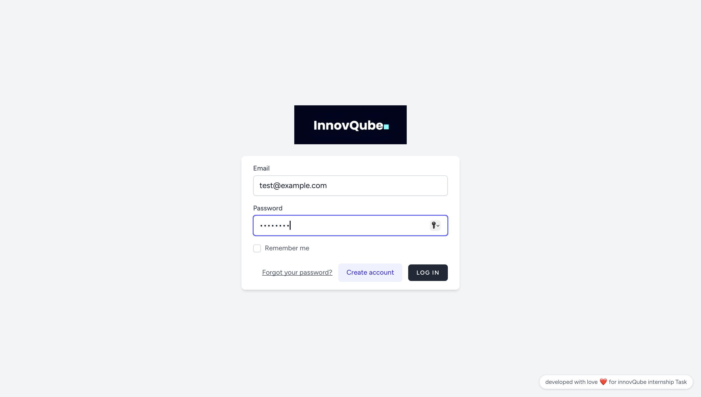
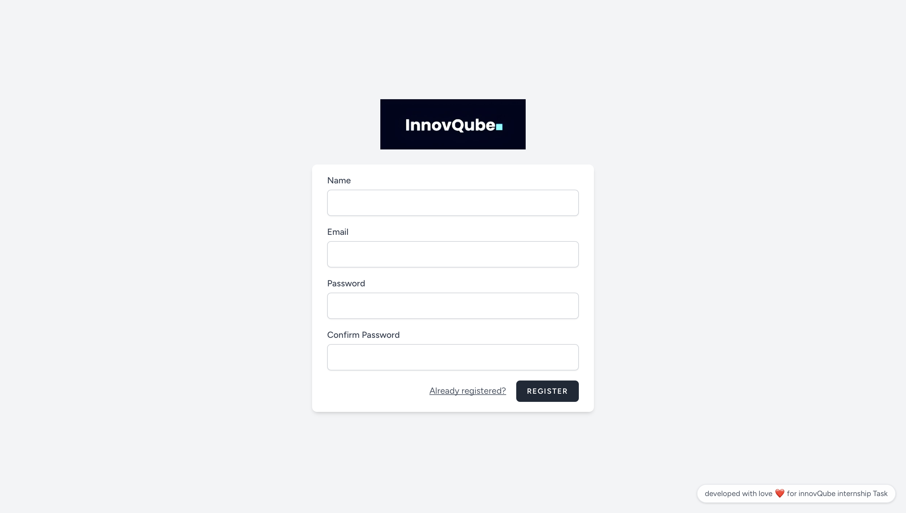
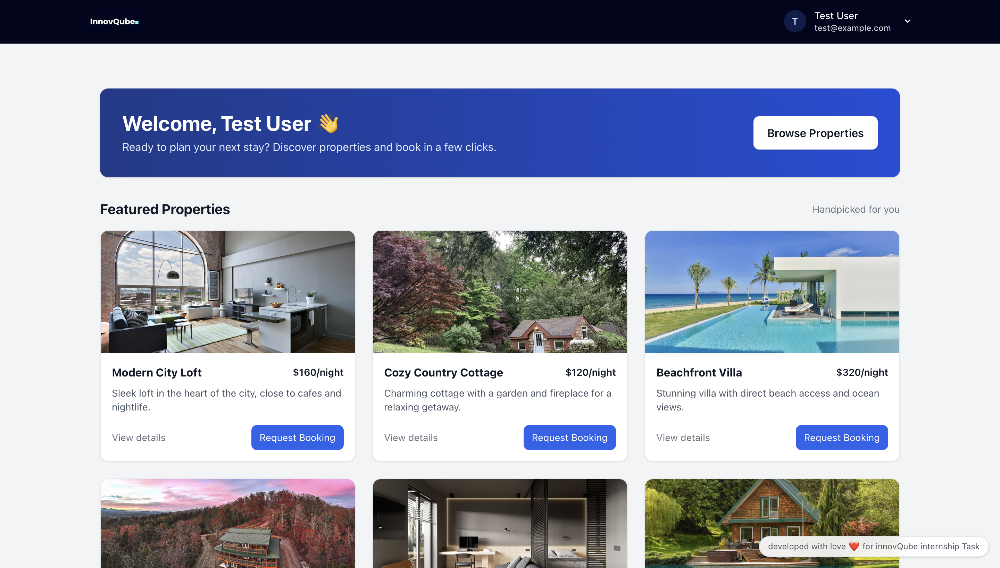
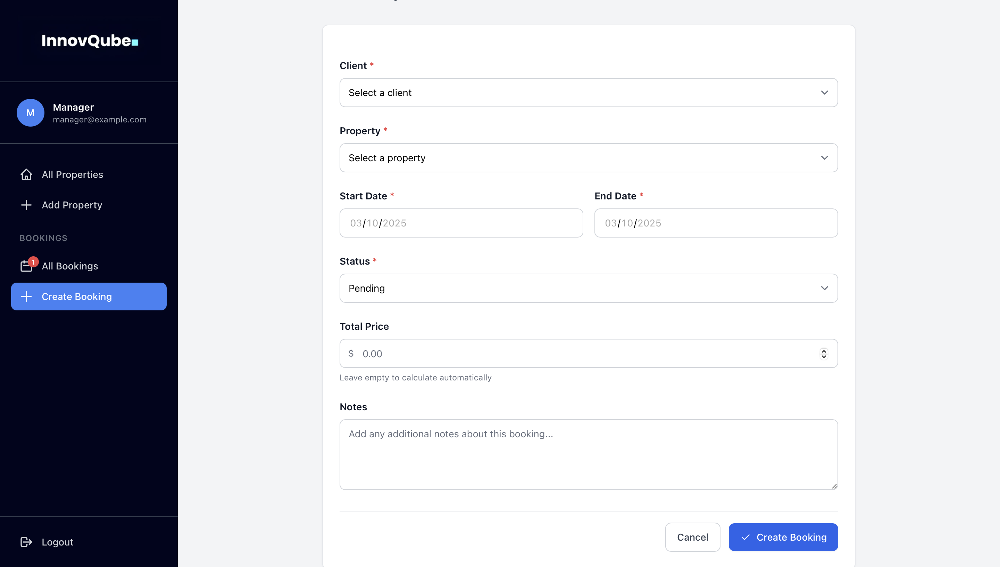
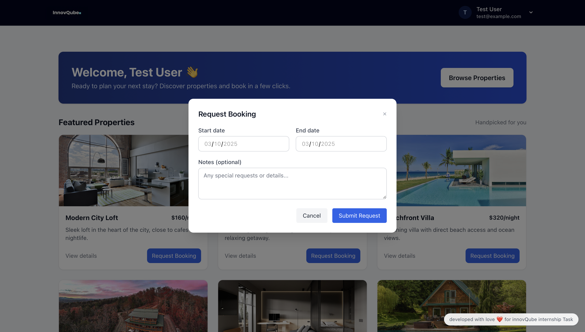
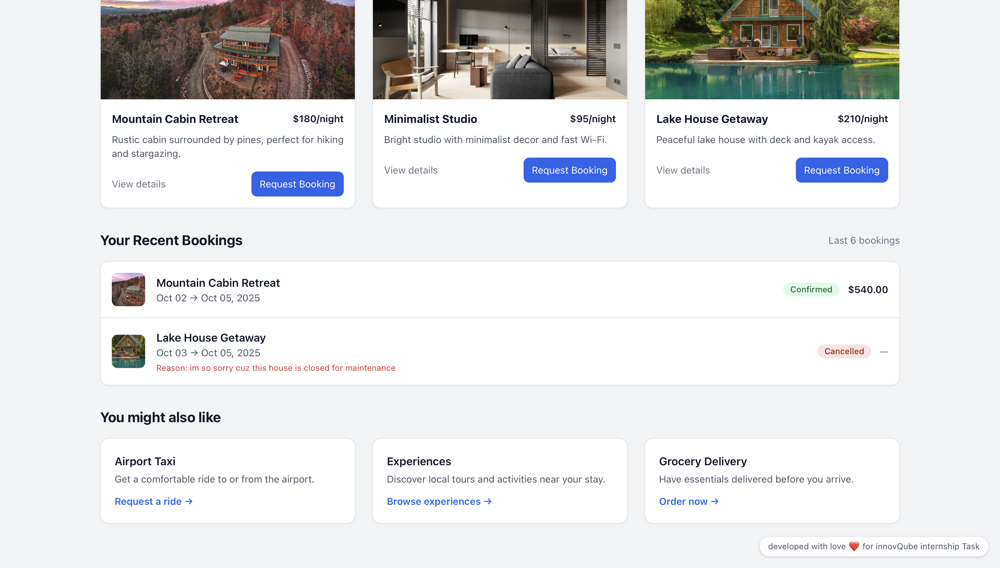
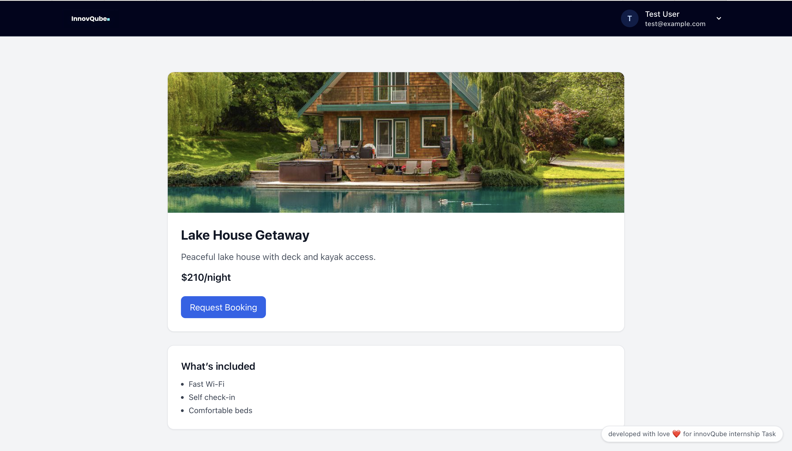
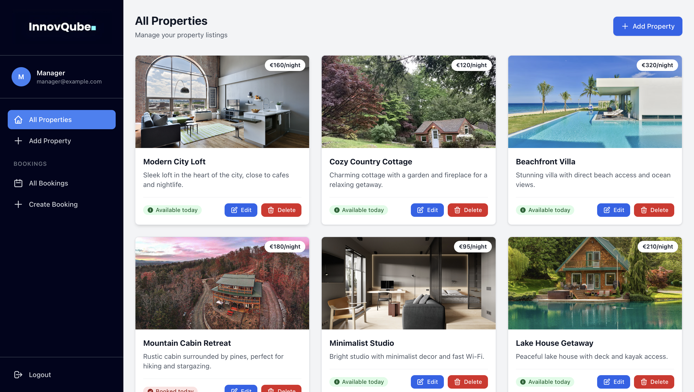
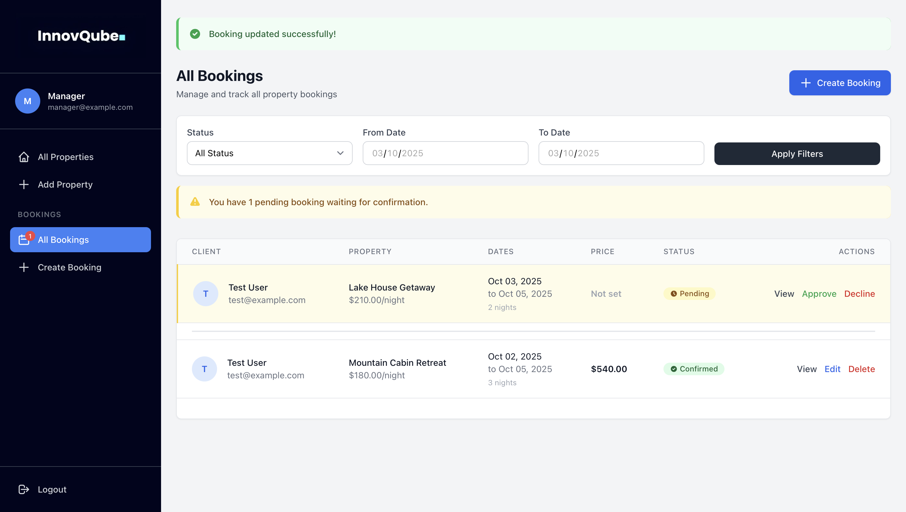
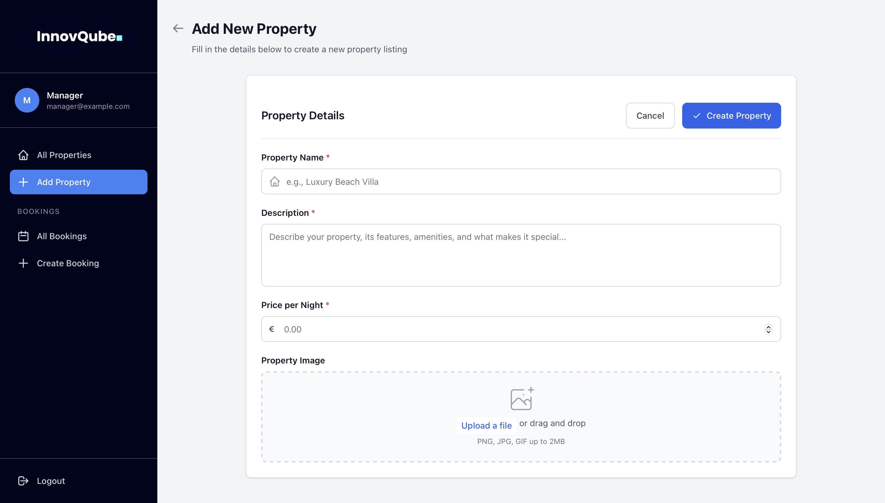

# Real Estate Bookings – InnovQube Internship Task

Below is the project documentation. The default Laravel README content has been removed to focus on this project.

## Important: .env setup (quick)

Set these in your `.env` before running migrations:

```env
APP_URL=http://localhost:8000
FILESYSTEM_DISK=public

DB_CONNECTION=mysql
DB_HOST=127.0.0.1
DB_PORT=3306
DB_DATABASE=laravel_test
DB_USERNAME=root
DB_PASSWORD=
```

Then run:

```bash
php artisan key:generate
php artisan storage:link
php artisan migrate:fresh --seed
```


## Overview

- **[Goal]** Build a small real-estate booking app with Laravel, Blade, TailwindCSS, and Alpine. Breeze handles auth. Manager can manage bookings; client can browse properties and request bookings.
- **[Status]** Functional app with auth, properties, client bookings, manager booking workflows, local seeded images, and calculated totals.

## Tech Stack

- **Backend:** Laravel 11 (PHP 8.1+)
- **Frontend:** Blade, TailwindCSS, Alpine.js
- **Auth:** Laravel Breeze (Blade)
- **DB:** MySQL
- **Build:** Vite, NPM

## Features

- **Authentication:** Login/Register via Breeze.
- **Role routing:** Redirects to `client.dashboard` or `manager.dashboard` based on `users.role`.
- **Properties:** Seeded demo properties with local curated images (`resources/assets/*`).
- **Client booking:**
  - Request booking from dashboard or property details.
  - Prevents date overlap against pending/confirmed.
  - Auto-calculates `total_price` = nights × `price_per_night`.
- **Manager booking:**
  - View/filter bookings, create/edit, confirm, cancel (with decline note).
  - Client sees decline note in dashboard bookings list.
- **UI/UX:**
  - Clean dashboards, property cards, modals (Alpine).
  - App bar avatar + email. Global bottom-right footer note.

## Getting Started

### Prerequisites

- PHP 8.1+, Composer, MySQL, Node.js + npm, Git

### Setup

1. Install dependencies
   - Backend: `composer install`
   - Frontend: `npm install`
2. Configure `.env`
   - Database connection (DB_*), `APP_URL=http://localhost:8000`
3. Generate app key
   - `php artisan key:generate`
4. Link storage (once)
   - `php artisan storage:link`
5. Build frontend
   - Dev: `npm run dev`
   - Prod: `npm run build`
6. Migrate and seed
   - `php artisan migrate:fresh --seed`

### Run the app

- `php artisan serve` → http://localhost:8000

## Seeded Data & Images

- Properties are created by `database/seeders/PropertySeeder.php`.
- Images are copied from `resources/assets/` to `public/storage/properties/`.
- Verify an image: open `/storage/properties/modern-city-loft.jpg` in browser.

## Key Files

- Routing: `routes/web.php`
- Layouts:
  - App: `resources/views/layouts/app.blade.php`
  - Guest: `resources/views/layouts/guest.blade.php`
- Navigation: `resources/views/layouts/navigation.blade.php`
- Client:
  - Dashboard: `resources/views/client/dashboard.blade.php`
  - Property details: `resources/views/client/properties/show.blade.php`
  - Booking store: `app/Http/Controllers/Client/ClientBookingController.php`
- Manager:
  - Bookings controller: `app/Http/Controllers/Manager/BookingController.php`
  - Bookings index view: `resources/views/manager/bookings/index.blade.php`
- Seeders:
  - `database/seeders/DatabaseSeeder.php`
  - `database/seeders/PropertySeeder.php`

## Notable Behaviors

- Booking overlap check considers `pending` and `confirmed` as blocking.
- Client booking `total_price` calculated server-side with Carbon date diff.
- Manager cancel stores a note; client sees “Reason: …” under cancelled bookings.

## Scripts and Commands

- Dev server: `php artisan serve`
- Build assets: `npm run dev` or `npm run build`
- Fresh DB + seed: `php artisan migrate:fresh --seed`
- Seed properties only: `php artisan db:seed --class=Database\\Seeders\\PropertySeeder`
- Routes list: `php artisan route:list`

## Screenshots

Below are real screenshots from this project (located in `./screenshots/`).

### Auth
- **Login**
  
  

- **Sign up**
  
  

### Client
- **Client dashboard** (properties grid + recent bookings)
  
  

- **Create booking (client quick action)**
  
  

- **Guest booking view**
  
  

- **Guest consult bookings (history/list)**
  
  

- **Property details**
  
  

### Manager
- **Manager dashboard**
  
  

- **Manager bookings dashboard/list**
  
  

- **Manager create property**
  
  

## Further Improvements

- Convert booking flows to Livewire components for real-time UX.
- Add Filament admin panel for CRUD on properties/bookings and RBAC.
- Add Policies/Gates for role-based access at model level.
- Notifications for booking confirmed/cancelled.
- More tests: booking creation, price calc, overlap prevention.

## Contact

- Deliverables and documentation to: `rh@innovqube.com`
